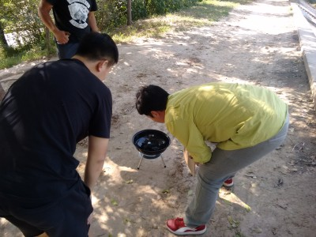
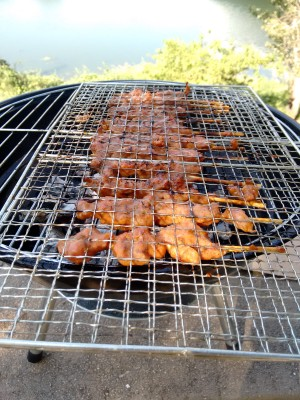

15年SFD烧烤派对.md
==================

按照惯例，TJLUG每年9月的活动都和天津本地的软件自由日活动合办。然而今年SFD所举行的会场远在天津大学的北洋源校区，所以我们准备在大学城附近另外举办一次烧烤派对来庆祝SFD。

本次活动设备由罗勇提供。

时间：9月19日（周六）上午11点
位置：大学城，地铁高新区站（地铁3号线）

联络人：

* 罗勇：18622708255
* richard_ma：15122131257（大家叫他马老师，当然你也可以这么叫）
* 凉拌茶叶：18222248865

活动记录
--------

=_= 由于罗哥忘记带上烧烤架子，于是我们坐着皮卡从原定集合位置来到了子牙河边进行活动。

