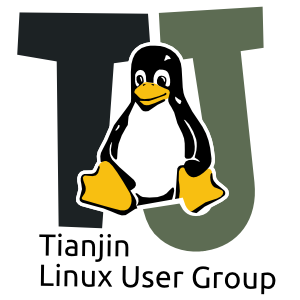

TJLUG BBS
=========

天津Linux用户组的Git BBS。

突然想到用Git来运行去中心化的BBS系统，用起来应该还是很有趣的。

* 发帖添加文件就行了
* 我将把发过贴的人拉到开发者里面

by 凉拌茶叶 2015年9月17日星期四 18:12

INFO
----

* 邮件列表：tjlug@googlegroups.com
	- 订阅：tjlug+subscribe@googlegroups.com
* **IRC: #tjlug@[libera.chat](https://libera.chat/)**
  - 为了“追求自由开放，传承社区文化”，我们决定重新启动IRC

活动通知及活动记录
------------------

* [21年3月活动](21年3月活动.md) **NEW**
* [16年6月活动](16年6月活动.md)
* [16年5月烧烤派对](16年5月活动.md)
* [16年4月活动](16年4月活动.md)
* [16年3月活动](16年3月活动.md)
* [15年SFD烧烤派对](15年SFD烧烤派对.md)

其他资源
--------

Google Group：http://groups.google.com/group/tjlug?hl=zh-CN
Github: https://github.com/TJLUG
Twitter ID：TianjinLUG

（招募管理者）文件归档：http://code.google.com/p/tjlug/
（招募管理者）人人公共主页：http://page.renren.com/601037199
（招募管理者）豆瓣小组：http://www.douban.com/group/tjlug/

有意向参与管理或者开发请直接将邮件发送至邮件列表，注明感兴趣的工作即可。
